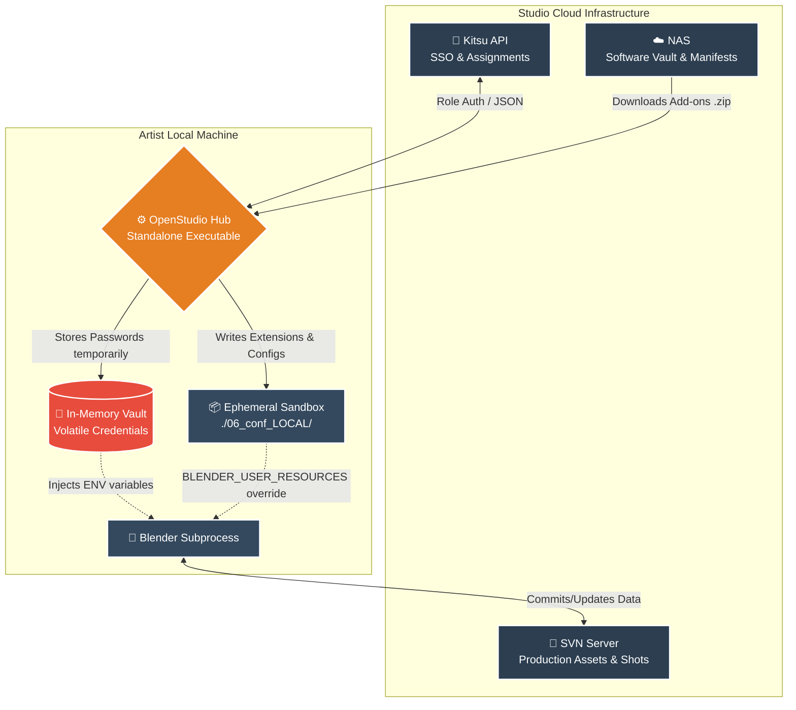
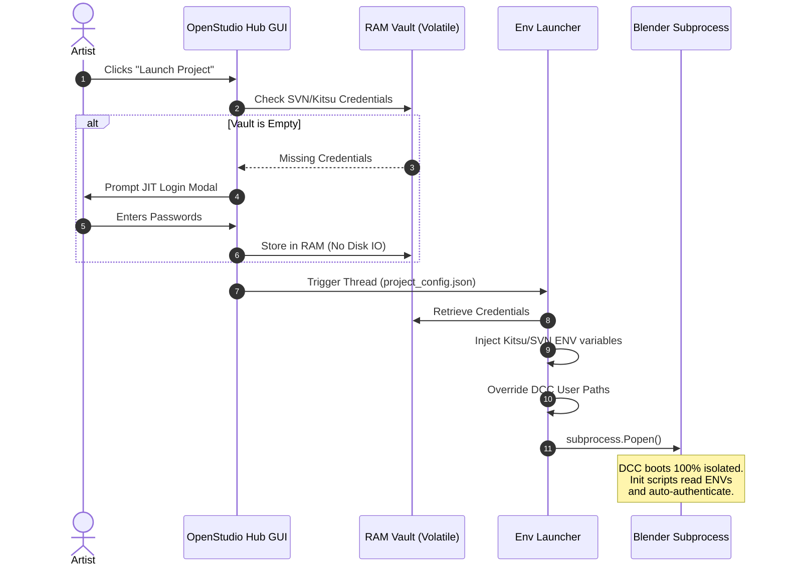

# OpenStudio Hub: Pipeline Management System


**OpenStudio Hub** is a standalone desktop application designed to orchestrate the production pipeline for a 3D animation studio. It acts as a seamless, deterministic bridge between artists, the version control system (SVN/NAS), and the production tracker (Kitsu).

> 🎬 **[Watch the Demo Video Showcase Here](https://estudiomacuare.com/wp-content/uploads/openstudio-hub-demo.mp4)**

---

## 🐘 The Elephant in the Room: Blender Studio Tools

Any studio working with Blender has looked with envy at the Blender Foundation's official pipeline. Tools like the `asset_pipeline` (designed to enable simultaneous work on the same asset) and `blender_kitsu` (which connects the 3D interface directly with the production manager) are, on paper, a Technical Director's dream come true.

However, there is an "elephant in the room" that few talk about: **these tools are not *plug-and-play*.**

Implementing the Blender Studio Tools ecosystem outside the Foundation's walls requires overcoming a brutal technical learning curve. If your studio doesn't replicate their exact network infrastructure, use their strict SVN configuration, or if you have artists working remotely on Windows instead of Linux, integration usually ends in broken scripts, lost paths, and hours of frustration for the IT team.

Here is where **OpenStudio Hub** comes in. Designed under a "zero friction" philosophy, it doesn't seek to reinvent the wheel, but to tame it. It works as a smart Sandbox environment that packages, pre-configures, and standardizes these powerful core tools, making them accessible to any studio—from an indie team to a mid-sized production company—with just a couple of clicks.

---

## ⚠️ The Problem: Changing Blender versions.
In large-scale productions, updating software versions or add-ons mid-show often breaks backward compatibility. Artists waste hours dealing with Python tracebacks, missing add-ons, and manual path configurations just to open a legacy file without corrupting modern production data.

## 💡 The Solution: A "rez-like" Ephemeral Sandbox
OpenStudio Hub solves this by reading the "DNA" (`project_config.json`) of each project and **building dynamic software containers at runtime**. It bypasses global OS installations completely by injecting environment variables (`BLENDER_USER_RESOURCES`, `BLENDER_USER_SCRIPTS`) to isolate extensions, wheels, and preferences per project. 

This guarantees **100% backward compatibility** and allows artists to run conflicting legacy tools (e.g., Blender 3.6) and modern pipelines (e.g., Blender 5.1) simultaneously with zero cross-contamination.

---

## 🏗️ High-Level Studio Architecture



---

## 🔒 Security: Just-In-Time (JIT) Credential Interception

Traditional pipelines often rely on saving plain-text network credentials on local disks, creating significant security vulnerabilities. OpenStudio Hub utilizes an **In-Memory Vault**. SVN and Kitsu passwords are asked once via a CustomTkinter modal, kept strictly in volatile RAM, injected into the DCC as OS environment variables during the subprocess launch, and wiped entirely upon logout.



---

## 💻 Development & Installation

The codebase is designed following the **Separation of Concerns (MVC)** principle, making it highly maintainable for Enterprise scaling.

1. Clone the repository:

```bash
git clone [https://github.com/tu-usuario/openstudio-hub.git](https://github.com/tu-usuario/openstudio-hub.git)
cd openstudio-hub

```

2. Create and activate the virtual environment:

```bash
python -m venv .venv
source .venv/bin/activate  # Linux/Mac
# .venv\Scripts\activate  # Windows

```

3. Install dependencies:

```bash
pip install -r requirements.txt

```

4. Run the Hub:

```bash
python openstudio_hub.py

```

## 📦 Packaging for Production

To distribute the tool to studio artists without requiring them to install Python, the application is "frozen" into a standalone executable using PyInstaller.

```bash
pyinstaller --noconsole --onefile --name "OpenStudio Hub" openstudio_hub.py

```

*(Note: The compiled executable is not tracked in this repository. Please visit the **Releases** tab to download the latest production build).*

---

*Developed by Ernesto Del Valle M. - Pipeline TD & Technical Artist.*
