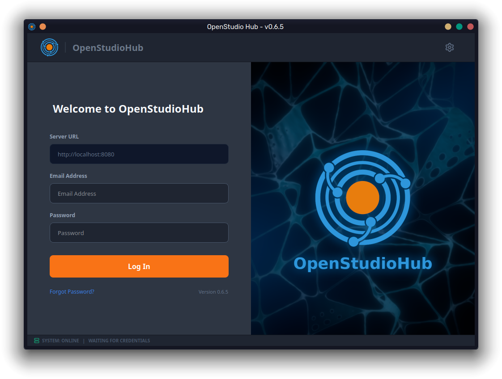

# Welcome to OpenStudioHub

**Automated pipeline orchestrator for Blender 3D studios.**

OpenStudio Hub is an advanced Desktop Client designed to eliminate daily production friction. By bridging the gap between your project management (Kitsu), your version control system (SVN), and your 3D Digital Content Creation tools (Blender), it ensures a bulletproof **Golden Path** for your artists.

Built as 100% Free Open-Source Software (GPL v3.0), the Hub provides Pipeline TDs total flexibility to customize and extend the codebase, while ensuring artists focus entirely on creation rather than figthing with a terminal.

---

## Why OpenStudio Hub?

We built this tool to solve the most expensive problem in 3D production: **Human Error**.

* **[Automated QA & Auto-Fixing (Gatekeeper)](features/automated-qa.md):** Detects and automatically fixes missing textures, dirty geometry, and wrong naming conventions *before* the artist publishes their work.
* **[Vendor Jailing & Sparse Checkout](features/vendor-jailing.md):** Protects your IP and saves bandwidth. Freelancers only download the exact files they need for their assigned task, nothing else.
* **[Automated Task Orchestration](features/kitsu-orchestration.md):** Connects directly to Kitsu. Translates database tasks into physical folder structures and generates master `.blend` files automatically.
* **[Standardized Workspaces](features/standardized-workspaces.md):** Downloads exact Blender versions and extensions, running them in an isolated sandbox to ensure the whole team is strictly on the same page.

---

## Documentation Navigation

Choose your path based on your role in the studio:

### For Artists
* [Getting Started](artist-guide/getting-started.md)
* [The Daily Workflow](artist-guide/daily-workflow.md)
* [Managing Feedback & Notes](artist-guide/feedback-and-notes.md)

### For Project Managers (PMs)
* [Managing projects and files](pm-guide.md)

### For Technical Directors (TDs) & Admins
* [System Requirements](admin-guide/system-requirements.md)
* [Studio Deployment](admin-guide/deployment.md)
* [Project Creation](admin-guide/project-creation.md)

---

## Support the Development

OpenStudioHub is built with passion to make open-source pipelines a viable reality for professional studios. If this tool saves your studio hours of technical debugging, consider supporting the core development!

[**Support the project on Ko-fi**](https://ko-fi.com/3dvm_dev)

## Ready to upgrade your studio?

Reach out to us at [contact@estudiomacuare.com](mailto:contact@estudiomacuare.com) to schedule a pipeline consultation.
